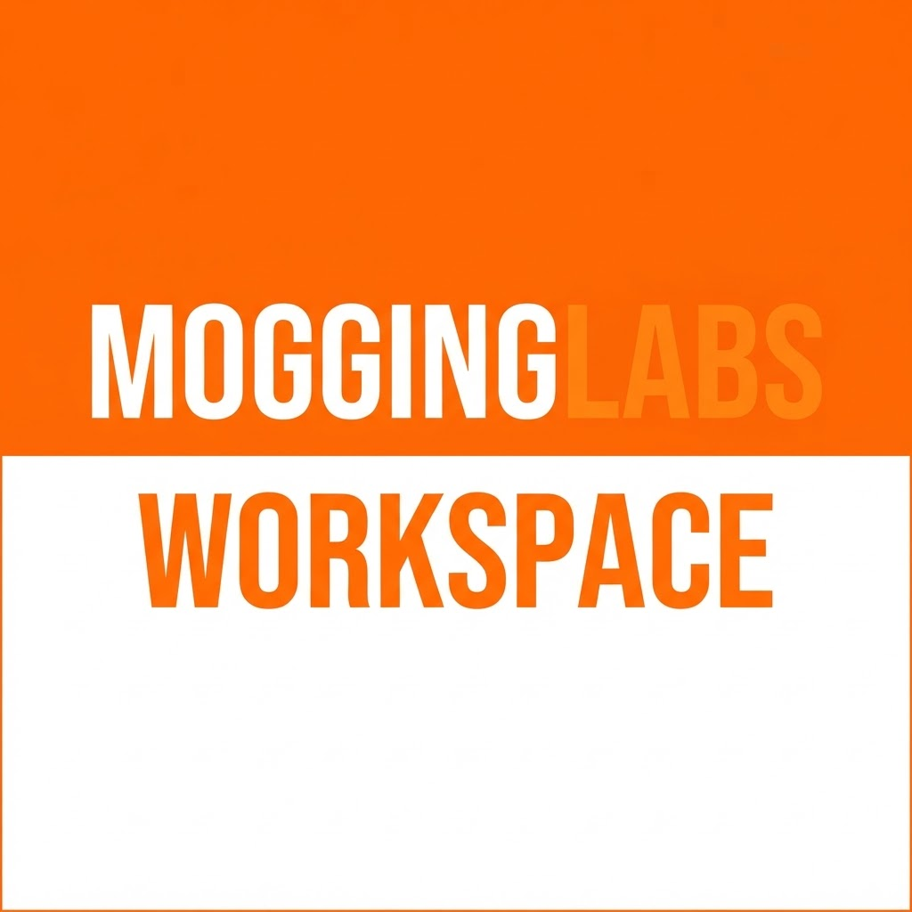

<p align="center">
  
</p>

# MoggingLabs Workspace

> A neutral, reliable, cross-platform organizer for AI coding-agent CLIs.
> **Your keys, your CLIs — no subscription to us. Rock-solid on Windows and Mac.**

MoggingLabs Workspace is a desktop app that runs and coordinates many parallel
AI coding-agent CLIs (Claude Code, OpenAI Codex, Gemini CLI, Aider, OpenCode, …)
in a fast multi-pane terminal with persistent workspaces. It **hosts the official
first-party CLIs as real PTY subprocesses** — each CLI authenticates *your* own
account (subscription or API key). The app **never brokers provider auth** and
takes **no cut of your AI usage**.

It is, in effect, a custom rival to BridgeMind's **BridgeSpace** — built on the
axes where the category is weakest: rendering reliability under many agents,
neutrality, scriptability, an open/local/no-account posture, and a non-copyleft
license.

## Why this exists (the wedge)

The strongest tools in this space each leave a hole:

- **cmux** — best agent-awareness UX, but **macOS-only**.
- **Warp** — polished + cross-platform, but **closed** and pushing **its own** AI agent.
- **tmux** — the persistence/scripting gold standard, but **no native Windows, no GUI, no agent-awareness**.
- **coder/mux** — cross-platform, but it's **its own AGPL agent**, not a neutral host.
- **BridgeSpace** — covers the most surface, but is **closed, $16–80/mo + account required**, and its changelog shows a **multi-month history of terminal-rendering/freeze bugs** (it's built on Tauri's *two* divergent WebView engines).

**Our lane:** the most reliable, identical-on-Windows-and-macOS, **neutral**,
**scriptable** organizer of first-party agent CLIs — free, local-first, and
non-AGPL. See [`docs/00-vision-and-positioning.md`](docs/00-vision-and-positioning.md).

## Tech stack

**Electron + xterm.js (WebGL) + node-pty**, with a persistent PTY-host process and
a platform-agnostic TypeScript engine. This is VS Code's exact terminal stack, and
— unlike Tauri — ships **one Chromium engine on both OSes**, so the terminal
renderer is tuned once and behaves identically everywhere. See
[ADR 0001](docs/adr/0001-electron-over-tauri.md).

## Quickstart

> **Status: Phase 8.5 (the UI/UX revamp) shipped** — the chrome caught up to the
> product. Phases 6–8 grew usage meters, five integration directions, a browser and a
> swarm faster than the surfaces around them: the wizard was three cramped modal
> screens, the folder picker a `cd` bar, Settings an unstyled wall of controls. This
> pack **audited every user-facing surface** (`prompts/phase-8.5/AUDIT.md` — graded,
> with keep/fix/remove verdicts and a `file:line` on every finding), then rebuilt them
> on one **layout vocabulary** (`Card` · `SectionHeader` · `FieldGroup` · `TwoColumn`,
> on the extended `--sp-*` ramp): the wizard is one full page beside the rail, a folder
> is pickable by click, Settings / Integrations / Usage open **overview-first** with
> persisted disclosure, plus Home + first-run, the board + palette, one feedback
> language, the titlebar / rail / pane chrome, the browser **possession banner**, and
> the Usage-glance CodexBar recut. **13 removals executed** (dead affordances deleted,
> not hidden) and **16 bugs routed and fixed**. Closed by the `MOGGING_UXMILESTONE`
> milestone: the whole revamp composed in one fixture world, zero network, behind a
> hard **coverage gate** (`check-audit.mjs` — no surface below grade **A**, no unrouted
> finding) and the spacing drift grep **frozen at zero** (`check-spacing.mjs --max 0`).
> **Both perf budgets unmoved** — an unchanged `docs/05` is the freeze criterion. The
> `qa-smokes.sh` sweep now runs **66 gates** (fourteen new this pack: WIZARDUX ·
> FOLDERPICK · SETSHELL · SETINTEG · SETUSAGE · HOMEUX · BOARDUX · FEEDBACKUX · CHROMEUX ·
> DOCKUX · USAGEGLANCE · UXMILESTONE, plus the two static gates AUDIT · SPACING). Design
> system: [`docs/11`](docs/11-design-system.md).
> Certified across **four environments** — all **66/66** green on local Windows AND all
> three CI OSes (Linux · macOS · Windows) in one clean dispatch, run **29006301457**;
> per-OS numbers + platform-find root causes in `prompts/phase-8.5/README.md` +
> `prompts/phase-8.5/REPORT.md`.
> (Phase 8 shipped integrations, five directions — `docs/14`; Phase 6 shipped v0.4.0:
> the browser dock + first-run/update UX + signing readiness.)

```bash
npm install        # builds native modules (node-pty). See note below.
npm run dev        # launch the app in dev mode
```

### Five minutes to your first agent workspace

The app guides this itself — Home shows a live **"Get set up"** checklist on
first run. The path:

1. **Install an agent CLI.** The checklist detects Claude Code, Codex, Gemini,
   Aider, and OpenCode on your PATH and shows the provider's own install
   one-liner with a copy button for any that are missing — e.g.
   `npm install -g @anthropic-ai/claude-code`. (We never install for you; the
   CLI is yours and self-authenticates — ADR 0002.)
2. **Open the app** and hit **New workspace** (`Ctrl/⌘+T`) — pick a folder and
   an agent lineup in the wizard.
3. That's it — you're in a working multi-pane agent workspace. The checklist
   ticks itself off as you go and never returns once done or dismissed.

Packaged builds keep themselves current: a new release downloads in the
background and offers a one-click **Restart now** (or ignore it — it installs
on next launch). See [`docs/10-distribution.md`](docs/10-distribution.md).

### The orchestration loop, scripted (only `mogging …` + the app)

```sh
mogging open ~/my-project --panes 4   # open the app on your repo (cold or running)
mogging list                          # see the fleet
mogging send 101 "claude"             # drive a pane… or use the Board (Ctrl+Shift+G):
                                      # New card -> ⋯ -> "Start Claude Code on this…"
                                      # -> isolated worktree pane, task = first prompt
mogging capture 101 --lines 40        # read scrollback from a script
# agent hooks fire `mogging notify --event needs-input` -> the card + rail light up
# pane ⋯ -> Review changes… -> redacted diff -> type "merge" -> landed
```

Details: [`docs/08-orchestration.md`](docs/08-orchestration.md) ·
[`docs/06-control-api.md`](docs/06-control-api.md) ·
perf + perception budgets: [`docs/05`](docs/05-perf-budget.md) / [`docs/07`](docs/07-perception-budget.md).

**Native modules — compiled from source (no prebuilts).** The app uses `node-pty` and
`better-sqlite3`, built against the exact Node/Electron ABI via `.npmrc` (`build_from_source=true`)
plus `buildDependenciesFromSource: true` in `electron-builder.yml` (the `postinstall` runs
`electron-builder install-app-deps`). So **`npm install` requires a C++ toolchain:**
- **Windows:** VS 2022 **C++ Build Tools** (VCTools workload) + **`node-gyp` ≥ 13** (devDep —
  older node-gyp fails the MSBuild step on VS 2022 / Node 24) + Python with **`setuptools`**
  (`pip install setuptools`, since Python ≥ 3.12 dropped `distutils`). Install the compiler:
  `winget install --id Microsoft.VisualStudio.2022.BuildTools --override "--quiet --wait --add Microsoft.VisualStudio.Workload.VCTools --includeRecommended"`.
- **macOS:** Xcode Command Line Tools.
- **Linux (Debian/Ubuntu):** `sudo apt install build-essential python3 python3-setuptools`
  (Fedora: `sudo dnf install @development-tools python3-setuptools`). Headless smokes
  need `xvfb`. Packaging: `npx electron-builder --linux` (AppImage + deb).

Native modules are `asarUnpack`ed for packaging. See [ADR 0001](docs/adr/0001-electron-over-tauri.md).

## Project structure

```
src/
  contracts/   Shared seam — domain types + typed IPC contract (depends on nothing)
  backend/     ALL Node-side logic; Electron-free. → core/ platform/ features/
  ui/          ALL renderer logic; never imports backend. → core/ shell/ features/
  main/        App-wiring: window + compose backend over an Electron context
  preload/     App-wiring: the generic, contracts-allowlisted window.bridge
  renderer/    App-wiring: renderer bootstrap that mounts @ui
  pty-host/    (Phase 1) dedicated persistent backend process
docs/
  00-vision-and-positioning.md
  01-architecture.md            tech tiers (Electron + xterm.js + node-pty)
  02-mvp-and-roadmap.md
  03-research-synthesis.md      full competitive + open-source research report
  04-adding-a-feature.md        the parallel-work playbook
  adr/                          decision records (0001–0004)
```

**Layer boundaries** (aliases `@contracts` / `@backend` / `@ui`): `contracts`
depends on nothing; `backend` and `ui` depend only on `contracts` and never on each
other; `main`/`preload`/`renderer` are the only composition root. See
[ADR 0004](docs/adr/0004-layered-feature-sliced-architecture.md).

## Roadmap (short form)

- **Phase 0** ✅ — Parity spike: one live agent PTY pane, identical on Win + Mac.
- **Phase 1** ✅ — MVP core: multi-pane grid, workspaces, detached PTY daemon, SQLite restore.
- **Phase 2** ✅ — Agent awareness: OSC state detection, command blocks, per-pane git, 16-agent perf budget.
- **Phase 3** ✅ — Orchestration: control API, worktree isolation, pre-ship review, Kanban board, end-to-end milestone.
- **Phase 4** ✅ — Swarm core: mailbox + roles, ownership ledger, reviewer gate, profiles + failover, SSH panes, Linux target.
- **Phase 5** ✅ — UI/UX excellence: AA-measured token system + vivid workspace identity, icon family, window-chrome fixes, full-app views, 14px terminal comfort (receipts: `prompts/phase-5/REPORT.md`).
- **Phase 6** ✅ — Product-ready: full Linux/macOS parity sweeps, browser dock, first-run + updates, v0.4.0.
- **Phase 7** ✅ — Usage & metering: CLI-owned session adapters, the usage gauge + Settings § Usage, the pointer-grammar key vault (receipts: `prompts/phase-7/README.md`).
- **Phase 8** ✅ — Integrations, five directions: the house MCP server (reads free, writes behind a per-workspace grant), the agent-web profile + activity trail, MCP registration across three CLI dialects + per-workspace tool plans, the outbound event bridge, live GitHub PR/issue chips — app holds no credential, daemon still v3. Closed by `MOGGING_INTEGMILESTONE`; surface in [`docs/14`](docs/14-integrations.md).
- **Phase 8.5** ✅ — The UI/UX revamp: an audit of every surface ([`AUDIT.md`](prompts/phase-8.5/AUDIT.md)), then rebuilt on one layout vocabulary (`Card`/`SectionHeader`/`FieldGroup`/`TwoColumn`, ramp extended to `--sp-7/8`) — one-page wizard, click-to-pick folder browser, overview-first Settings, Home/first-run, board + palette, one feedback language, chrome + possession banner, the Usage-glance recut; 13 removals, 16 bugs fixed; spacing frozen at zero, both budgets unmoved. Closed by `MOGGING_UXMILESTONE` + the `check-audit.mjs` coverage gate (receipts: `prompts/phase-8.5/README.md`).

Full plan: [`docs/02-mvp-and-roadmap.md`](docs/02-mvp-and-roadmap.md).

## License

Proprietary / all rights reserved (experiment stage). Final license TBD —
deliberately **non-AGPL**; a permissive/source-available posture is a competitive
selling point. See [`LICENSE`](LICENSE).
